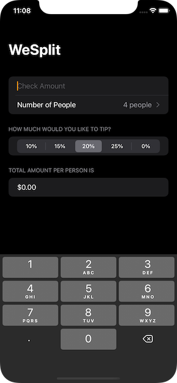
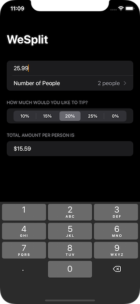

# About WeSplit

ℹ️ WeSplit is the 1st real world project of [\#100DaysOfSwiftUI](https://www.hackingwithswift.com/100/swiftui/) course by [Paul Hudson](https//twitter.com/twostraws)

🔗 Original link: [Here](https://www.hackingwithswift.com/100/swiftui/16)

📸 Screenshots:

☝🏻P/s: In the formatting and display of the totalPerPerson property, I followed [this solution](https://www.hackingwithswift.com/quick-start/swiftui/formatting-interpolated-strings-in-swiftui) from Paul to return a currency formatted string instead.

